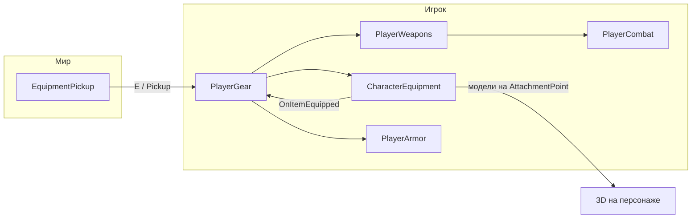

# Снаряжение и подбор (без инвентаря)

Документ для UI, геймдизайна и сценаристов уровней. Описывает апдейт, в котором **инвентарь и хотбар убраны**: игрок подбирает предметы с земли **сразу в экипировку** (в руки, на голову, на тело и т.д.), с тем же набором уходит в бой и между сценами.

---

## Кратко: как это выглядит для игрока

1. На уровне лежат объекты с компонентом `EquipmentPickup` (меч, щит, шлем…).
2. Игрок подходит на расстояние `pickupRadius` (по умолчанию 2 м), видит подсказку **«E — взять»** (временно через `OnGUI` на `PlayerGear`; UI может заменить).
3. Нажатие **E** (`InputHandler.InteractPressed`) вызывает `PlayerGear.Pickup` → предмет надевается через `CharacterEquipment`.
4. Если новое оружие **двуручное** (или лук с подкатегорией `Ranged`), оно **вытесняет** вторую руку (щит / второе оружие). Вытесненный предмет **падает на землю** новым пикапом — положить некуда.
5. Снаряжение **сохраняется** в `gear.json` и **переносится между сценами** (статический словарь в `PlayerGear`).

---

## Архитектура (кто за что отвечает)



| Компонент | Роль |
|-----------|------|
| **`EquipmentItem`** (ScriptableObject) | Описание предмета: `itemId`, иконка, категория, класс оружия / кусок брони из таблицы баланса. |
| **`EquipmentDatabase`** | Реестр всех предметов; по `itemId` для сохранений и стартового набора. |
| **`CharacterEquipment`** | Логика слотов на персонаже, модели на точках крепления, **правила рук** (двуручное ↔ щит). |
| **`PlayerGear`** | Подбор с земли, связь с боем (`PlayerWeapons`, `PlayerArmor`), сохранение, событие для UI. |
| **`EquipmentPickup`** | Предмет в мире + фабрика `Drop()` для выброшенного снаряжения. |
| **`EquipmentDetailsPanel`** | Панель описания: статы через `item.GetDisplayStats()`. |

На объекте **Player** в боевых сценах обычно висят: `CharacterEquipment`, `PlayerGear`, `PlayerWeapons`, `PlayerArmor`, `InputHandler`.

---

## Слоты экипировки (`EquipmentSlot`)

Единый перечень для кода, сохранения и UI. **Не путать** с категорией в меню (`EquipmentCategory`).

| `EquipmentSlot` | Что надето | Пустой слот в UI |
|-----------------|------------|------------------|
| `Helmet` | Шлем | `"none"` или пустая иконка |
| `Body` | Нагрудник / броня корпуса | `"none"` |
| `Arms` | Парная броня на руках (один логический слот, две модели) | `"none"` |
| `Legs` | Парная броня на ногах | `"none"` |
| `RightHand` | Основная рука (меч, двуручное, лук…) | `"none"` |
| `LeftHand` | Вторая рука (щит, баклер) | `"none"` |

**Статус «что надето» для HUD** (аналог старого `SelectedItems`, но без инвентаря):

```json
{
  "helmet": "helm_t2",
  "body": "none",
  "arms": "none",
  "legs": "none",
  "rightHand": "weapon_4",
  "leftHand": "weapon_2"
}
```

Значения — **`itemId`** из ассета `EquipmentItem`, либо строка **`"none"`** / отсутствие ключа, если слот пуст.

---

## Привязка UI к слотам

### Рекомендуемый источник данных

1. **`CharacterEquipment`** — актуальное состояние «на персонаже»:
   - `GetEquipped(EquipmentSlot slot)` → `EquipmentItem` или `null`.
2. **`PlayerGear`** — удобные свойства для рук и подписка на изменения:
   - `MainHand` → `RightHand`
   - `OffHand` → `LeftHand`
   - `HandsFull` → в правой руке двуручное (щит взять нельзя)
   - `HasShield` → во второй руке off-hand (щит)
   - **`event Action OnGearChanged`** — вызывается после подбора, смены, загрузки, сброса.

### Пример: обновить иконки слотов

```csharp
using CharacterEquipment;
using UnityEngine;
using UnityEngine.UI;

public class GearSlotView : MonoBehaviour
{
    [SerializeField] private EquipmentSlot slot;
    [SerializeField] private Image icon;
    [SerializeField] private Sprite emptySprite;
    [SerializeField] private CharacterEquipment characterEquipment;

    private void OnEnable()
    {
        var gear = FindFirstObjectByType<PlayerGear>();
        if (gear != null) gear.OnGearChanged += Refresh;
        Refresh();
    }

    private void OnDisable()
    {
        var gear = FindFirstObjectByType<PlayerGear>();
        if (gear != null) gear.OnGearChanged -= Refresh;
    }

    public void Refresh()
    {
        var item = characterEquipment.GetEquipped(slot);
        if (item == null || item.icon == null)
        {
            icon.sprite = emptySprite;
            icon.enabled = emptySprite != null;
            return;
        }
        icon.sprite = item.icon;
        icon.enabled = true;
    }
}
```

На каждый визуальный слот в макете — свой `EquipmentSlot` в инспекторе.

### Панель статов выбранного предмета

Уже есть **`EquipmentDetailsPanel.Show(EquipmentItem item)`**. Статы **не хранятся в ассете числами** — считаются из таблиц:

- оружие: `weaponClass` → `VomicaBalance`
- броня: `armorPiece` → `VomicaBalance.ArmorPresets`

Дополнительные полоски вручную: `EquipmentItem.extraStats`.

---

## Предмет (`EquipmentItem`): что заполняет дизайнер

| Поле | Назначение |
|------|------------|
| **`itemId`** | Уникальный ключ (`weapon_4`, `helm_t0`). Используется в сохранении и `PlayerWeapons`. |
| `displayName`, `description`, `icon` | UI |
| `category` | Куда надевается (`Helmet`, `Armor`, `Weapon`, `Arms`, `Legs`) |
| `weaponSubCategory` | Вкладки UI оружия + запасной расчёт рук, если класса нет в документе (лук → `Ranged` = 2 руки) |
| **`weaponClass`** | Для оружия: все боевые числа из документа баланса |
| **`armorPiece`** | Для брони: защита A, профиль, штрафы из таблицы |
| `modelPrefab`, `modelPrefabLeft`, `holdPose` | Визуал и аниматор |

**Сколько рук занимает оружие** (для подсказок и логики вытеснения):

- в первую очередь **`WeaponClassStats.Hands`** из баланса;
- иначе по `weaponSubCategory`: `TwoHanded` / `Ranged` → 2, `Shield` → 0 (левая), `OneHanded` → 1.

Свойства в коде: `IsTwoHanded`, `IsOffHand`, `PreferredHand`.

---

## Правила рук (важно для UI-предупреждений)

Реализованы в **`CharacterEquipment.EquipHand`**:

| Действие игрока | Результат |
|-----------------|-----------|
| Берёт **двуручное** / **лук** (`Ranged`) | Слот `LeftHand` освобождается, прежний предмет **вытесняется на землю** |
| Берёт **щит**, в другой руке уже **двуручное** | Двуручное снимается и падает на землю |
| Берёт **новое одноручное** в ту же руку | Старое в этом слоте вытесняется на землю |
| Берёт **шлем / броню** | Заменяет предмет в соответствующем слоте (без «рюкзака») |

`PlayerGear` на время подбора щита при уже экипированном двуручном показывает оранжевое дополнение к подсказке: *(двуручное уйдёт на землю)*.

Событие **`CharacterEquipment.OnItemDisplaced`** → `PlayerGear` создаёт **`EquipmentPickup.Drop`** с задержкой `dropPickupDelay` (по умолчанию 1 с), чтобы предмет не подобрали сразу же.

---

## Подбор и объекты на сцене

### Готовый пикап в редакторе

1. Пустой GameObject (или prefab).
2. **SphereCollider** (trigger, радиус ~0.35) — без коллайдера `OverlapSphere` не найдёт предмет.
3. Компонент **`EquipmentPickup`**, в поле **Item** — ссылка на `EquipmentItem`.
4. Опционально: `spawnModel`, `spinSpeed`, `pickupDelay`.

В **`TestingMoving`** уже лежат: `Pickup_Sword`, `Pickup_Buckler`, `Pickup_Hummer`, `Pickup_Helm_T2`; у игрока **`startingGear` пустой** — нужно собраться с земли.

### Программный выброс

```csharp
EquipmentPickup.Drop(item, worldPosition, pickupDelaySeconds: 1f);
```

Или с игрока: **`PlayerGear.DropSlot(EquipmentSlot slot)`** (публичный API для UI «сбросить»).

---

## Сохранение

| Параметр | Значение |
|----------|----------|
| Файл | `Application.persistentDataPath` + **`gear.json`** (имя задаётся в `PlayerGear.saveFileName`) |
| Формат | JSON, класс **`GearSaveData`**: `version`, список `{ slot, itemId }` |
| Когда пишется | После изменения снаряжения (батч в `LateUpdate`, не на каждый слот отдельно) |
| Между сценами | Статический **`Carried`** в `PlayerGear` — первый заход в Play Mode грузит файл или `startingGear` |

Публичные методы:

- **`Save()`** / **`Load()`** — ручное управление
- **`ResetGear()`** — контекстное меню на компоненте: удалить файл, снять всё, выдать `startingGear`

Для отладки путь к файлу: **`PlayerGear.SavePath`**.

---

## Связь с боем (не дублировать в UI «выбор оружия цифрами»)

`PlayerGear` при старте выставляет **`PlayerWeapons.SelectWithNumberKeys = false`**. Переключение оружия цифрами обходит руки и рассинхронизирует урон с тем, что реально надето.

При надевании в **`RightHand`**:

1. `PlayerWeapons.SelectWeaponById(itemId)` если запись уже есть;
2. иначе привязка к существующей записи с тем же `weaponClass`;
3. иначе `AddWeapon` с классом из предмета.

Шлем и корпус идут в **`PlayerArmor`** (слоты Helmet / Body).

**Ограничение:** `PlayerArmor` пока учитывает только **голова + корпус**. Предметы категорий **`Arms`** / **`Legs`** надеваются на модель и попадают в сохранение, но **защита в бою не меняется** — в консоль один раз пишется предупреждение из `PlayerGear`.

---

## Смена оружия «во время боя»

Игрок **не листает инвентарь**: он подбирает **другое** оружие с земли (или с точки на арене) — оно экипируется по тем же правилам рук. Для UI арены можно:

- показывать ближайший `EquipmentPickup` (логика поиска уже в `PlayerGear`, радиус `pickupRadius`);
- дублировать подсказку в Canvas, отключив **`showPrompt`** на `PlayerGear`.

Отдельного списка «все оружия в кармане» **нет**.

---

## Точки крепления (`AttachmentPoint`)

На полноценном меше персонажа (например, сцена с ригом) дочерние объекты с **`AttachmentPoint`** (`Head`, `Body`, `LeftHand`, `RightHand`…).

- Если точки **есть** — модель оружия/брони спавнит **`CharacterEquipment`**.
- Если точек **нет** (тестовый кapsule в `TestingMoving`) — предмет **всё равно считается надетым**, статы работают; в консоли предупреждение «модель не появится». Одноручное оружие может показываться через **`PlayerWeapons.modelAttachPoint`**, если настроено.

---

## Чеклист для UI-разработчика

- [ ] На префабе HUD: 6 слотов с enum **`EquipmentSlot`**, подписка на **`PlayerGear.OnGearChanged`**.
- [ ] Пустой слот: `GetEquipped(slot) == null` → `"none"` / заглушка.
- [ ] Иконка и название: из **`EquipmentItem.icon`**, **`displayName`**.
- [ ] Детали предмета: **`EquipmentDetailsPanel.Show(item)`** или свой UI + **`GetDisplayStats()`**.
- [ ] Подсказка подбора: **`InputHandler.InteractPressed`** (E) или слушать **`PlayerGear.Pickup`** из своего триггера.
- [ ] Не делать отдельный «инвентарь-сетку» под экипировку — источник правды один: **`CharacterEquipment`** + сохранение **`gear.json`**.
- [ ] Предупреждение при подборе щита при двуручном: **`PlayerGear.HandsFull`** и тип пикапа **`EquipmentItem.IsOffHand`**.

---

## Чеклист для level design

- [ ] Предмет на земле = **`EquipmentPickup`** + trigger collider.
- [ ] **`itemId`** предмета есть в **`EquipmentDatabase`** на игроке (`PlayerGear.database`).
- [ ] После выброса/вытеснения учитывать **`pickupDelay`**, чтобы игрок не зациклил подбор.

---

## Файлы в проекте

```
Assets/Scripts/Equipment/
  PlayerGear.cs          — подбор, сохранение, связь с боем
  EquipmentPickup.cs     — лежащий в мире предмет
  ReadmeGear.md          — этот файл

Assets/Scripts/CharEqiup/
  CharacterEquipment.cs
  EquipmentItem.cs
  EquipmentDatabase.cs
  EquipmentTypes.cs      — EquipmentSlot, категории
  EquipmentDetailsPanel.cs

Assets/Scripts/Balance/
  VomicaBalance.cs
  VomicaCombatTypes.cs   — WeaponClass, ArmorPiece
```

Старый каталог **`Assets/Scripts/Inventory`** удалён; на него опираться не нужно.

---

## Частые вопросы

**Где взять список всех предметов для энциклопедии?**  
`EquipmentDatabase.allItems` или фильтры `GetByCategory` / `GetWeaponsBySubCategory`.

**Как выдать стартовый набор в новой игре?**  
Список **`startingGear`** на `PlayerGear` (пары slot + itemId). Применяется только если нет сохранения и `Carried` ещё пуст.

**Можно ли надеть предмет из UI без пикапа?**  
Да, вызов **`characterEquipment.Equip(item)`** (и при необходимости синхронизация через события — проще вызывать логику через существующий пайплайн `PlayerGear`, если добавите публичный метод-обёртку под ваш экран). Сейчас основной путь — **`PlayerGear.Pickup`** и загрузка **`ApplyCarried`**.

**Почему молот выбивает щит?**  
В таблице баланса класс **Hammer** — две руки; у ассета выставлено **`TwoHanded`**. Это ожидаемое поведение.
